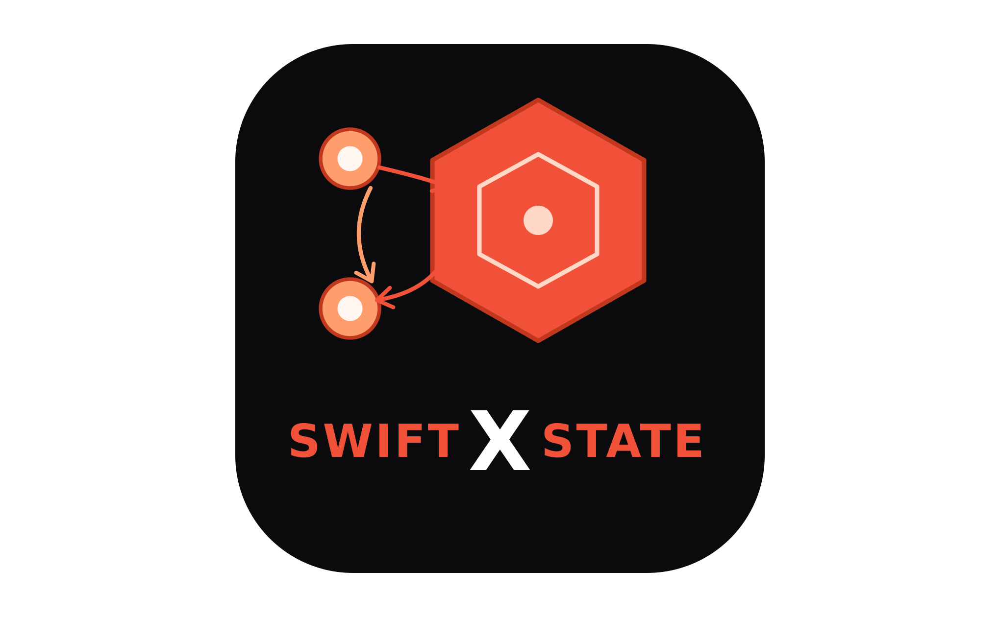
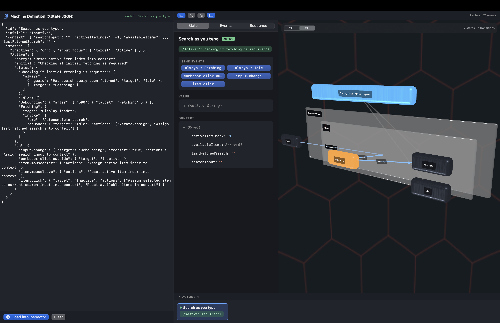
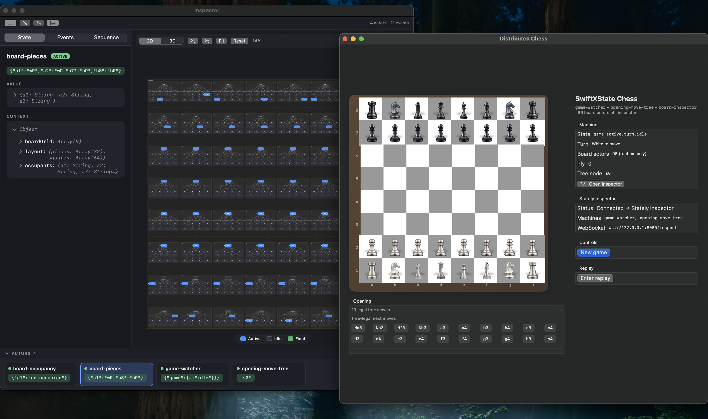
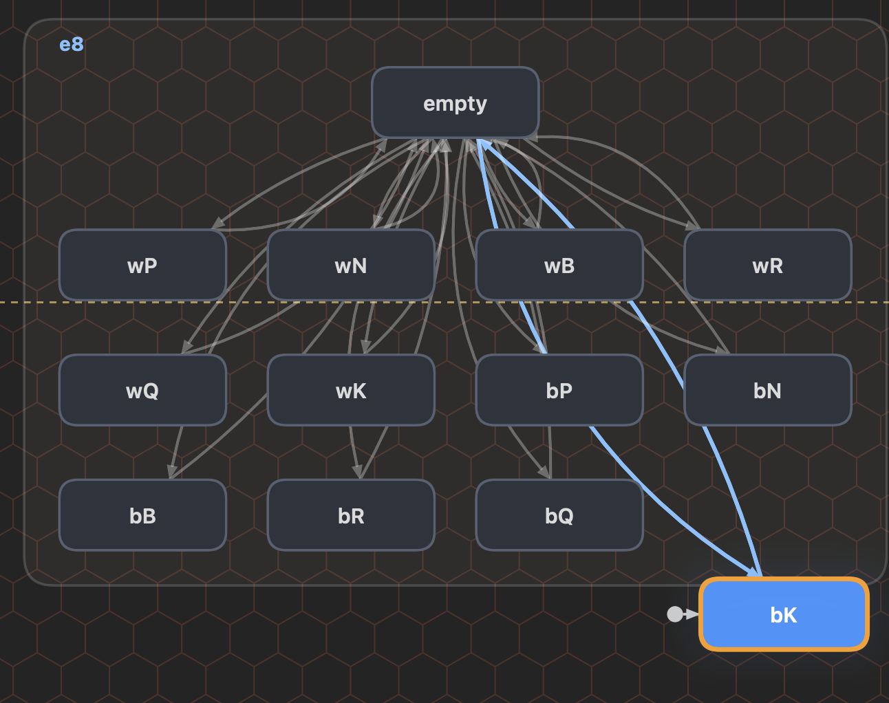

# SwiftXState

[](LICENSE)
[](https://gistya.github.io/SwiftXState/documentation/swiftxstate/)

## What is this useful for?

1. Own your logic and events with (state)-flow-(state) graphs. 
2. Track it live with built-in JSON streams & 2D/3D visualizer. 
3. Rewind/replay your whole program with snapshots. 
4. Load statecharts from JSON at runtime to tweak behavior.

## Where can I run it?

1. Server or client.
2. Web: use [Stately.a's XState.js](https://github.com/statelyai/xstate) 
3. WebAssembly: *experimental* SwiftXState for [wasm](https://github.com/gistya/swiftxstate/Examples/WasmDemo)/[WebGPU](https://github.com/gistya/swiftxstate/Examples/WasmGPUDemo)
4. Linux ([how-to](https://github.com/gistya/swiftxstate/LINUX_SETUP.md))
5. Windows (compiles but not tested yet)
6. macOS/iPadOS ([sample Chess app](https://github.com/gistya/swiftxstate/Examples/SwiftXChess), [sample visualizer app](https://github.com/gistya/swiftxstate/Examples/SwiftXInspector))
7. iOS/visionOS/watchOS/tvOS 

## What libraries comes in the package?

1. SwiftXState - all platforms - static library, core features
2. SwiftXStateInspect - all platforms - localhost JSON streaming in [XState.js](https://stately.ai)-format 
3. SwiftXStateGraph - all Apple platforms - SwiftUI state graph renderer in 2D and 3D (note: does not render in 3D on visionOS yet)
4. SwiftXStateInspectorUI - all Apple platforms - SwiftUI info displays for displaying Inspect streams
5. SwiftXStateSwiftUI - all Apple platforms - wire your SwiftUI view states up to SwiftXState state stores
6. SwiftXStateSwiftData - all Apple platforms - persistent data storage adapter
7. ... plus some fun bonus items ;D

## How far along is this project?

- Feature-complete beta phase (see roadmap items below). 
- Now with documentation (thanks to the awesome [swift-docc](https://github.com/swiftlang/swift-docc))

## Documentation & Articles - [here.](https://gistya.github.io/SwiftXState/documentation/swiftxstate/)


- Docs are generated with DocC automatically from doc comments in the codebase, and published to GitHub Pages from `main` pushes by
[`.github/workflows/static.yml`](.github/workflows/static.yml) on every merge. (The site goes live
after the first successful run.)

## Acknowledgments

SwiftXState would not exist without the work of **[Stately](https://stately.ai)** and the **[XState](https://github.com/statelyai/xstate)** team.

XState's open-source design, documentation, inspector protocol, and machine-definition shape are the foundation this project builds on. Stately's decision to publish `@statelyai/inspect`, document the wire format, and keep the core model approachable is exactly what makes a native Swift reimplementation possible — and legitimate.

Thank you to David Khourshid and everyone who has contributed to XState and the Stately ecosystem. This project is a complement, not a replacement: we want Swift developers to speak the same state-machine language as the web, while leaning into what Swift does best.

## Dependencies

- SwiftXState/Inspect/URLSession: Foundation and stdlib structured concurrency only
— Apple-specific modules: SwiftUI, SwiftData
- wasm: [JavaScriptKit](https://github.com/swiftwasm/JavaScriptKit) 

## Quick start

We offer two main API paths:

- Text mode, for compatibility with [XState.js](https://github.com/statelyai/xstate) and prototyping, ease of juming in, etc.
- Typesafe mode, the true Swift way, using generics for compile-time guarantees and fewer bugs
- Documentation linked above has guides for both

### Text API example:

- Create a new state machine and "actor" to manage it:

```swift
import SwiftXState

let toggle = createMachine(MachineConfig(
    id: "toggle",
    initial: "inactive",
    context: EmptyContext(),
    states: [
        "inactive": StateNodeConfig(on: ["toggle": .to("active")]),
        "active": StateNodeConfig(on: ["toggle": .to("inactive")]),
    ]
))

let actor = createActor(toggle).start()
actor.send(Event("toggle"))
print(actor.snapshot.matches("active")) // true
```

- Use `@MachineStates` macro to generate `StateName` enums from the strings in the machine declarations.
- That way, you still get autocomplete and protection against typos and name drift:

```swift
@MachineStates("AppState")
let config = MachineConfig(id: "app", initial: "idle", context: Ctx(), states: [
    "idle":    StateNodeConfig(on: transitions(on(Focus.self, to: AppState.active))),
    "active":  StateNodeConfig(states: ["fast": StateNodeConfig(), "slow": StateNodeConfig()]),
])
// generates: enum AppState: String, StateName { case idle; case active; case activeFast = "active.fast"; … }
// AppState.activeFast → "#active.fast"  (absolute target, resolves regardless of nesting)
```

- Set the legal transition rules for a each node in your state graph: 

```swift
StateNodeConfig(on: [
    "input.focus":  .to("active"),
    "input.change": .single(TransitionConfig(target: "debouncing")),
])
```

### Type-safe API example:
```swift
struct InputChange: StateEvent { static let eventType = "input.change"; let searchInput: String }

StateNodeConfig(on: transitions(
    on(Focus.self, target: "active"),
    on(InputChange.self, target: "debouncing",
       actions: [assign { (ctx: inout Ctx, e: InputChange) in ctx.searchInput = e.searchInput }])
))

actor.send(InputChange(searchInput: "be"))   // typed at the call site
```

- Also note, this app uses the type-safe APIs [Examples/SwiftXChess](Examples/SwiftXChess/README.md).

## State Graph Analysis

- Like the original `@xstate/graph`, our Swift version provides APIs to analyze your state graphs during testing to ensure that your assumptions are correct:

```swift
let model = TestModel(toggle)

for path in model.shortestPaths() {
    print(path.description) // e.g. "-toggle-> active"
    try model.test(
        path,
        onState: { snapshot in /* assert your UI matches snapshot.value */ },
        onEvent: { event in   /* drive your component with event */ }
    )
}

// Static checks over the reachable graph:
for issue in model.validate() {
    print(issue.kind, issue.stateKey) // .deadEnd / .unreachableState
}
```

- (Similar features: `getAdjacencyMap`, `getShortestPaths`, `getSimplePaths`, `validate`.) 
- You can also tune traversal with `TraversalOptions` (custom event resolver, state serialization, `maxStates`).

## XState → SwiftXState terminology guide:

| XState (TS) | SwiftXState |
|-------------|-------------|
| `createMachine({ … })` | `createMachine(MachineConfig(…))` |
| `setup({ actions, guards, delays, actors })` | `setup(actions:guards:delays:actors:)` |
| `setup({ types: { events, context } })` | typed `Context` generic + Tier-2 `StateEvent` types |
| `on: { EVENT: 'target' }` | `on: ["EVENT": .to("target")]` (Tier 1) / `on(EventType.self, target: "target")` (Tier 2) |
| `target: 'someState'` (string) | `to: AppState.someState` — compile-checked via `@MachineStates` |
| `assign({ x: ({ event }) => … })` | `assign { (ctx: inout C, e: EventType) in ctx.x = … }` (Tier 2) |
| `assertEvent(event, "…")` | not needed — the Tier-2 handler is already typed to the event |
| `guard: 'name'` / `({ context, event }) => …` | `guard: .named("name")` / `guarded { (c, e: EventType) in … }` |
| `always`, `after`, `invoke`, `spawn`, `raise`, `sendTo`, tags, `meta` | same names, same model |

---

## Included Sample Apps for Mac/iPad

### SwiftXInspector App:

- Paste in JSON machine descriptions in XState JSON format to see a realtime visualization. 
- Note: does not yet support pasting in JavaScript functions.



### SwiftXChess:

- Demonstrates the live inspection features of SwiftXGraph and SwiftXInspect
- Shows the power of GPU-accelerated Metal rendering in SwiftUI



- Each board square has different inspectable state depending upon which kind of piece might be present:  



## Parity with XState

The table below summarizes where SwiftXState stands today relative to **XState v5** and the broader Stately ecosystem. Status meanings:

- **✅ Parity** — implemented and tested
- **🔶 Partial** — works for common cases; known gaps listed
- **➕ SwiftXState only** — not in stock XState (or not in the same form)
- **📋 Planned** — intended; not implemented yet
- **➖ N/A** — platform or ecosystem difference, not a goal for native Swift

### Core state machines

| Capability | Status | Notes |
|------------|--------|-------|
| `createMachine` / `setup().createMachine()` | ✅ Parity | `MachineConfig`, `StateNodeConfig` mirror XState config |
| State types (atomic, compound, parallel, final, history) | ✅ Parity | Shallow and deep history |
| Events (`Eventable`, `Event("TAP")`, string shorthand) | ✅ Parity | Custom `Eventable` types supported (see SwiftXChess) |
| Wildcard transitions (`*`, `prefix.*`) | ✅ Parity | |
| Guards (named, inline, `and` / `or` / `not`, `stateIn`) | ✅ Parity | |
| Parameterized guards `{ type, params }` | ✅ Parity | `guardRef(_:params:)`, `dynamicGuard`, `setup().registerGuard` |
| Actions (assign, raise, sendTo, spawn, stop, log, emit, …) | ✅ Parity | |
| `enqueueActions` | ✅ Parity | |
| `always` transitions | ✅ Parity | |
| `after` delayed transitions | ✅ Parity | Named delays via `setup(delays:)` |
| Internal transitions (actions only, no target) | ✅ Parity | |
| `reenter` | ✅ Parity | |
| Parallel regions + multi-target transitions | ✅ Parity | |
| Tags + `snapshot.hasTag(_:)` | ✅ Parity | |
| State `meta` on config | ✅ Parity | `StateNodeConfig.meta` + `snapshot.getMeta()` |
| Final state `output` + `status: done` | ✅ Parity | |
| `xstate.done.state.{id}` (nested final completion) | ✅ Parity | `StateNodeConfig.onDone` + `DoneStateEvent` |
| Pure `transition()` / `initialTransition()` | ✅ Parity | Side effects not run in pure path |
| `waitFor` | ✅ Parity | |
| `SimulatedClock` | ✅ Parity | Deterministic delays in tests |

### Actors and invoke

| Capability | Status | Notes |
|------------|--------|-------|
| `createActor` + mailbox + `send` | ✅ Parity | See [Concurrency](#concurrency-swiftxstate-actor-vs-swift-actor) |
| `invoke` / `spawnChild` | ✅ Parity | |
| `fromMachine` (child state machines) | ✅ Parity | |
| `fromTask` (`fromPromise`) | ✅ Parity | `async throws` with structured scope |
| `fromCallback` | ✅ Parity | Long-running listeners + cleanup |
| `fromTransition` | ✅ Parity | |
| `fromObservable` / `Subscribable` | ✅ Parity | |
| `fromStore` | ✅ Parity | XState store actor logic |
| `fromTaskGroup` | ➕ SwiftXState only | Structured concurrent child work via `TaskGroup` |
| `sendBack` in callback actors | ✅ Parity | `CallbackActorScope.sendBack` — alias for `sendToParent` |
| `ActorSystem` (register, get, inspect) | ✅ Parity | |
| `forwardTo`, `sendTo` (with delay), `sendParent` | ✅ Parity | |
| `emit` + `actor.on("eventType")` | ✅ Parity | |

### Persistence and replay

| Capability | Status | Notes |
|------------|--------|-------|
| `getPersistedSnapshot` / `restoreSnapshot` | ✅ Parity | Requires `Codable` context |
| `actor.start(from:)` hydration | ✅ Parity | Two-step: `createActor` then `start(from:)` |
| `createActor(..., snapshot:)` one-shot hydration | ✅ Parity | Already started; `ActorPersistenceStore.createActor(_:key:)` for SwiftData |
| Child actor state in persisted snapshots | ✅ Parity | **Machine** children round-trip recursively; opaque children persist status only — use `onCancel` + `opaqueRestorePolicy` for SwiftData cleanup / deferred re-spawn |
| **Replay sessions** (record, pure replay, scrub) | ➕ SwiftXState only | `ReplaySession`, `RecordedStep`, `ReplayDriver` |
| Replay with full custom event payloads | ✅ Parity | `ReplayPayloadRepresentable`, `PayloadEvent`, `ReplayEventDecoder` |
| **SwiftData persistence** | ➕ SwiftXState only | `ActorPersistenceStore`, `ReplayPersistenceStore` |

### Inspector and tooling

| Capability | Status | Notes |
|------------|--------|-------|
| Inspection protocol (`@xstate.*` events) | ✅ Parity | |
| Stately wire format + `@statelyai/inspect` | ✅ Parity | `StatelyWireConverter`, WebSocket transport |
| `definitionJSON()` export | ✅ Parity | Stately-compatible machine graphs |
| Machine JSON **import** | 🔶 Partial | Load any XState machine-definition JSON into the inspector (`MachineDefinitionImporter` / `InspectorStore.loadDefinition`): renders the graph and reconstructs the initial state value + `context`. A **structural simulator** (`MachineSimulator`) then lets you click through `on` / `always` / `after` / `invoke.onDone` transitions, with synthetic event + snapshot rows feeding the Events/Sequence tabs. Control-flow only — guards aren't evaluated and actions/`assign`/actors don't run (those are code, not data). See [`Examples/InspectorPasteApp`](Examples/InspectorPasteApp/). Full round-trip back to `definitionJSON()` is still planned. |
| `meta` in exported definitions | ✅ Parity | |
| `@xstate/graph` (paths, TestModel, validation) | ✅ Parity | **Core**, cross-platform (Linux too): `getAdjacencyMap`, `getShortestPaths`, `getSimplePaths`, `TestModel` (model-based path testing via `test(_:onState:onEvent:)`), and `validate` (dead-end + unreachable-state checks). Built on the faithful pure `transition` (guards evaluated, `assign` applied), with `TraversalOptions` for custom event resolvers / state serialization. **Note:** this is the algorithm layer — distinct from the like-named `SwiftXStateGraph` *visualizer* module (same collision exists in XState). |
| Native SwiftUI visualizer | ✅ | `SwiftXStateGraph` library: GPU-backed `Canvas` 2D renderer + SceneKit 3D mode, walks the real machine tree (nested compound/parallel regions, transitions, initial/final markers), live active-state highlighting, anchored zoom / pan / node-drag (+ mouse-wheel on macOS), themeable via `GraphStyle`. |
| Browser `__xstate__` devtools hook | ➖ N/A | Stately inspect covers cross-platform debugging |

### Type safety and DX

| Capability | Status | Notes |
|------------|--------|-------|
| `setup(actions:guards:delays:actors:)` | ✅ Parity | |
| `setup({ types: { events, context } })` inference | ✅ Parity | Context is statically typed (`MachineConfig<Context>`). The **Tier-2 typed API** models each event as its own `StateEvent` type and keys transitions on it, so guard/action closures receive the **concrete, narrowed event** — no cast, no `assertEvent`. The **`@MachineStates` macro** generates a `StateName` enum from a machine's own declarations, giving compile-checked, autocompleted, rename-safe **targets** (`to: AppState.running`) with zero drift. Achieves XState's typing outcomes through Swift's type identity + macros rather than TS literal inference. |
| `mapState` | ✅ Parity | Nested `StateMap` → `[MapStateEntry]`; `mapStateFirst` for view models |
| `getNextSnapshot` alias | 📋 Planned | `transition()` already provides this |
| **SwiftUI bindings** (`useMachine`, `useSelector`, `useMapState`) | ➕ SwiftXState only | Apple platforms; parallel to `@xstate/react` |
| **Pluggable inspect transports** (`InspectTransport`) | ➕ SwiftXState only | `ClosureInspectTransport`, file/mock transports; URLSession optional |
| `@xstate/react` / Vue / Svelte bindings | ➖ N/A | SwiftUI is the Apple-native binding layer |

### Standards and interchange

| Capability | Status | Notes |
|------------|--------|-------|
| XState machine-definition JSON (export) | ✅ Parity | For Stately graph rendering |
| XState machine-definition JSON (import) | 🔶 Partial | Structural import into the inspector (graph + initial state + click-through stepping); see Inspector & tooling. Behavior (guards/actions/actors) is not reconstructed — it lives in code, not the definition |
| **SCXML** import / export | 📋 Planned | XState itself is SCXML-*inspired* rather than a full SCXML engine; we aim to support practical SCXML interchange for enterprise and telecom workflows |
| W3C SCXML execution semantics (full) | 📋 Planned | Large spec; will be incremental |

### Platform strengths (SwiftXState direction)

| Capability | Status | Notes |
|------------|--------|-------|
| Compiled iOS / macOS / watchOS / tvOS / Linux / Windows apps | ➕ SwiftXState only | No JS runtime required |
| Strict concurrency / `Sendable` machine model | ➕ SwiftXState only | Enabled on core targets |
| C / C++ / Objective-C interop from actions & actors | 📋 Planned | Invoke `fromCallback` / `fromTask` as integration points |
| Offline-first native persistence | ➕ SwiftXState only | SwiftData module; Core Data / file stores possible |

---


---

## Development

```bash
# Run all package tests (Apple platforms)
swift test

# Run core tests only
swift test --filter SwiftXStateTests
```

The core test suite covers guards, invoke/spawn, parallel transitions, history, replay, persistence, inspection, and SwiftXChess integration scenarios.

### Linux smoke test (Ubuntu)

On a Linux host with Swift 6.2+ installed ([swift.org install guide](https://www.swift.org/install/linux/)):

```bash
# Clone or sync the repo, then:
chmod +x Scripts/linux-smoke-test.sh
./Scripts/linux-smoke-test.sh
```

This builds `SwiftXState`, `SwiftXStateInspect`, and the URLSession inspect stub, then runs `SwiftXStateTests` and `SwiftXStateInspectTests`. It skips Apple-only SwiftData test targets. Report failures with `swift --version` and the full script output.

---

## Roadmap (maybe-board)

1. Opaque child checkpoint payloads: optional persisted job ledger metadata beyond status-only snapshots
2. SCXML interchange: import/export for standards-based workflows (as soon as we finish our XML parser)
4. Machine JSON import: structural import + click-through simulation shipped (see `InspectorPasteApp`); full round-trip back to `definitionJSON()` still planned
5. On-device live run of imported machines: execute an imported XState machine's real behavior (guards/actions/actors) on iOS/macOS via in-process `JavaScriptCore`, bridging XState's `inspect` callback into `InspectionEvent`, so any JS machine runs live in the native inspector without a Node relay
6. Load machine configs / full machines from external sources: awaiting security review.

## Related links

- [XState](https://github.com/statelyai/xstate) — the JavaScript reference implementation
- [Stately](https://stately.ai) — visual editor, inspector, and state-machine tooling
- [@statelyai/inspect](https://github.com/statelyai/inspect) — inspector protocol SwiftXState speaks on the wire
- [SCXML (W3C)](https://www.w3.org/TR/scxml/) — historical spec that influenced XState's design
## License

SwiftXState is released under the [MIT License](LICENSE).

```
Copyright (c) 2026 Jonathan Gilbert

Permission is hereby granted, free of charge, to any person obtaining a copy
of this software and associated documentation files (the "Software"), to deal
in the Software without restriction, including without limitation the rights
to use, copy, modify, merge, publish, distribute, sublicense, and/or sell
copies of the Software, and to permit persons to whom the Software is
furnished to do so, subject to the following conditions:

The above copyright notice and this permission notice shall be included in all
copies or substantial portions of the Software.

THE SOFTWARE IS PROVIDED "AS IS", WITHOUT WARRANTY OF ANY KIND, EXPRESS OR
IMPLIED, INCLUDING BUT NOT LIMITED TO THE WARRANTIES OF MERCHANTABILITY,
FITNESS FOR A PARTICULAR PURPOSE AND NONINFRINGEMENT. IN NO EVENT SHALL THE
AUTHORS OR COPYRIGHT HOLDERS BE LIABLE FOR ANY CLAIM, DAMAGES OR OTHER
LIABILITY, WHETHER IN AN ACTION OF CONTRACT, TORT OR OTHERWISE, ARISING FROM,
OUT OF OR IN CONNECTION WITH THE SOFTWARE OR THE USE OR OTHER DEALINGS IN THE
SOFTWARE.
```

SwiftXState is an independent open-source project inspired by and interoperable with Stately's XState. It is not affiliated with or endorsed by Stately. XState itself is licensed separately by its authors; see the [XState repository](https://github.com/statelyai/xstate) for its terms.