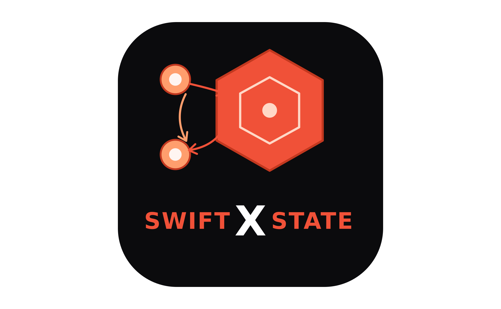
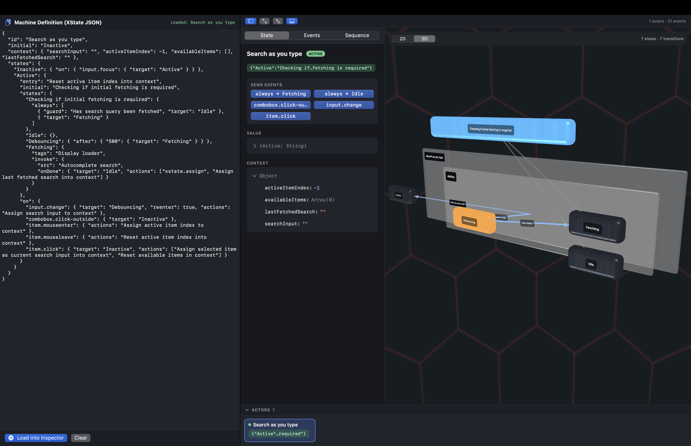
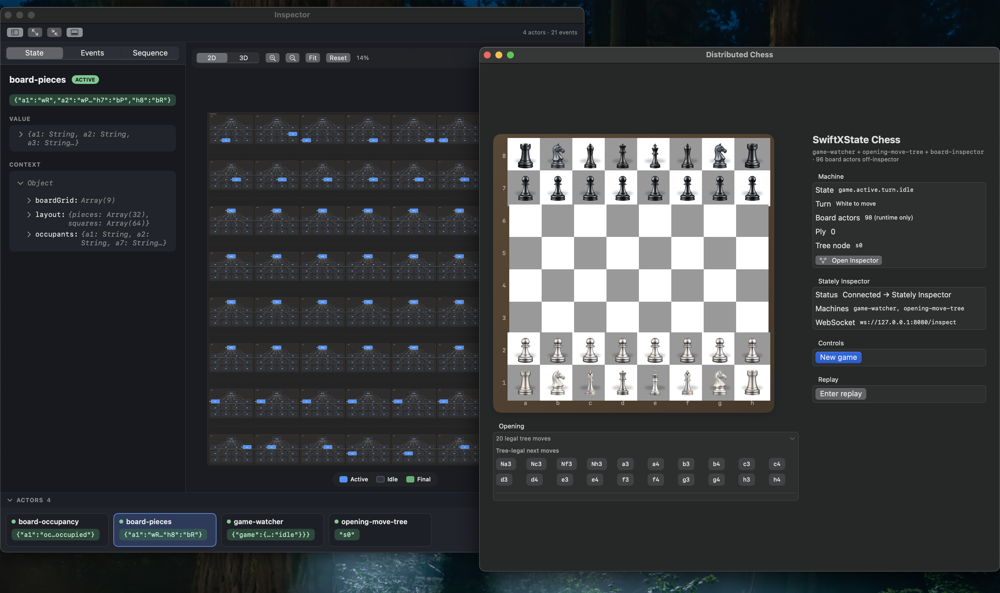
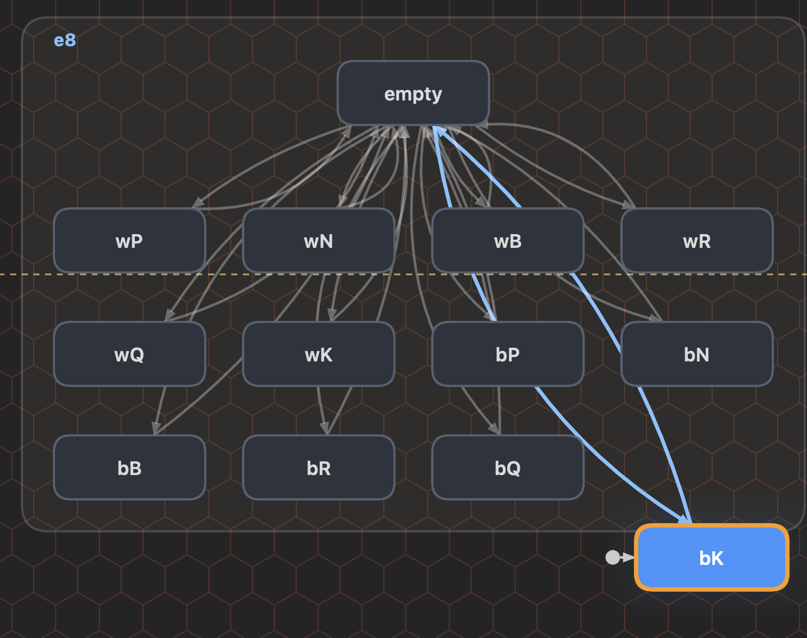

# <p style="text-align: center;"> SwiftXState
[](LICENSE) 
[](https://gistya.github.io/SwiftXState/documentation/swiftxstate/)


---

### *"If you don't have an explicit state machine, you have an implicit one."* <br> <p style="text-indent: 2em;"> - David Khourshid


--- 
<br>

# ~ click(for: [Documentation](https://gistya.github.io/SwiftXState/documentation/swiftxstate/)) ~

<br>

---


## SwiftXState adapts the popular XState.js actor-as-state-machine-owner model to Swift's concurrency-based actor model, where actors are threadsafe, isolated background contexts and UI can update seamlessly from their @MainActor store.

<br>

--- 
<br>

# README Contents

- [Cross-Platform Guides](#cross-platform-guides)
- [FAQ](#faq)
- [Code Examples](#code-examples)
    - [Text API example](#text-api-example)
    - [Type-safe API example](#type-safe-api-example)
    - [State Graph Analysis](#state-graph-analysis)
- [Included Sample Apps (iPadOS/macOS)](#sample-apps-ipadosmacos)
- [XState.js Adoption & Parity](#xstatejs-adoption--parity)
    - [XState → SwiftXState terminology guide](#xstate--swiftxstate-terminology-guide)
    - [Parity with XState](#parity-with-xstate)
- [Roadmap](#roadmap)
- [Related Links](#related-links)
- [Security Policy](SECURITY.md)
- [License](#license)

<br>

---
<br>

# Cross-Platform Setup Guides

- ### **[Apple macOS Setup Guide](MAC_SETUP_GUIDE.md)**
- ### **[linux Setup Guide](LINUX_SETUP.md)**
- ### **[Microsoft Windows Setup Guide](WINDOWS_SETUP.md)**

<br>

---
<br>

# ~ FAQ ~


## What is SwiftXState useful for?

1. Own your logic and events with (state)-flow-(state) graphs. 
2. Track it live with built-in JSON streams & 2D/3D visualizer. 
3. Rewind/replay your whole program with snapshots. 
4. Load statecharts from JSON at runtime to tweak behavior.
5. Offload business logic to threadsafe background executors with asynchronous Swift `actor`s, which gain deterministic behavior thanks to XState wizardry.

## Where can I run it?

1. Server or client.
2. Node.js: use [Stately.a's XState.js](https://github.com/statelyai/xstate).
3. WebAssembly: *experimental* — the [browser inspector](https://github.com/gistya/swiftxstate/tree/main/Examples/WasmInspector) runs SwiftXState in wasm with a WebGPU state-graph
4. Linux ([Linux build README](LINUX_SETUP.md), or get prebuilt NuGet)
5. Windows ([Windows build README](WINDOWS_SETUP.md), or get prebuilt NuGet)
6. macOS/iPadOS ([sample Chess app](https://github.com/gistya/swiftxstate/Examples/SwiftXChess), [sample visualizer app](https://github.com/gistya/swiftxstate/Examples/SwiftXInspector))
7. iOS/visionOS/watchOS/tvOS: also supported, no sample apps yet.

## How secure is SwiftXState?

Every effort has been made to ensure you can trust this library. For details, see: [SECURITY.md](SECURITY.md). 

## What libraries comes in the package?

1. SwiftXState - all platforms - static library, core features
2. SwiftXStateInspect - all platforms - localhost JSON streaming in [XState.js](https://stately.ai)-format 
3. SwiftXStateGraph - all Apple platforms - SwiftUI state graph renderer in 2D and 3D (note: does not render in 3D on visionOS yet)
4. SwiftXStateInspectorUI - all Apple platforms - SwiftUI info displays for displaying Inspect streams
5. SwiftXStateSwiftUI - all Apple platforms - wire your SwiftUI view states up to SwiftXState state stores
6. SwiftXStateSwiftData - all Apple platforms - persistent data storage adapter
7. ... plus some fun bonus items ;D

## How far along is this project?

- Feature-complete beta phase (see roadmap items below). 
- Now with documentation (thanks to the awesome [swift-docc](https://github.com/swiftlang/swift-docc))

## "Actor" vs. Swift `actor`

- Swift's `actor` is about asynchronous isolation and data-race safety.
- XState.js's `Actor` is about state machines running synchronous, deterministic transitions with replayability.
- The initial beta of SwiftXState used Swift's `class` to implement `Actor` for compatibility with XState.js, where `Actor`s deterministically orchestrate run-to-completion events on the main thread.
- Now, since 1.0, SwiftXState uses `Swift actor` for our `Actor`. 

## Acknowledgments

- SwiftXState would not exist without the work of **[Stately](https://stately.ai)** and the **[XState](https://github.com/statelyai/xstate)** team.
- Thank you to **David Khourshid**, founder of Stately.ai and XState, in particular for blessing this project.
- Thank you to everyone who contributed to XState.js and the Stately ecosystem. 
- Thank you to Stately for their inspiring commitment to open source.

## Dependencies

- SwiftXState/Inspect/URLSession: Foundation
- SwiftUI and/or SwiftData modules require Apple platforms
- WebAssembly requires [JavaScriptKit](https://github.com/swiftwasm/JavaScriptKit) 
- Since 1.0, we dropped `swift-syntax` as a dependency and transitioned away from macros.

## Quick start

We offer two main API paths:

- Text mode, for compatibility with [XState.js](https://github.com/statelyai/xstate) and prototyping, ease of juming in, etc.
- Typesafe mode, which models events as `StateEvent` types and states as `StateName` enums for additional compile-time safety.
- Documentation linked above has guides for both

---
<br>

# Code Examples

## Text API example:

- Create a new state machine and "actor" to manage it:

    ```swift
    import SwiftXState

    let toggle = createMachine(MachineConfig(
        id: "toggle",
        initial: "inactive",
        context: EmptyContext(),
        states: [
            "inactive": StateNodeConfig(on: ["toggle": .to("active")]),
            "active": StateNodeConfig(on: ["toggle": .to("inactive")]),
        ]
    ))

    let actor = await createActor(toggle).start()
    await actor.send(Event("toggle"))
    print(await actor.snapshot.matches("active")) // true
    ```

- Declare a `StateName` enum (one `String`-backed case per state) for autocomplete and protection
  against typos and name drift. Nested states get a compound case name with a dotted raw value:

    ```swift
    enum AppState: String, StateName {
        case idle
        case active
        case activeFast = "active.fast"   // AppState.activeFast → "#active.fast" (absolute target)
    }

    let config = MachineConfig(id: "app", initial: "idle", context: Ctx(), states: [
        "idle":    StateNodeConfig(on: transitions(on(Focus.self, to: AppState.active))),
        "active":  StateNodeConfig(states: ["fast": StateNodeConfig(), "slow": StateNodeConfig()]),
    ])
    ```

- Set the legal transition rules for a each node in your state graph: 

    ```swift
    StateNodeConfig(on: [
        "input.focus":  .to("active"),
        "input.change": .single(TransitionConfig(target: "debouncing")),
    ])
    ```

## Type-safe API example:

- SwiftXState features two tiers of APIs. The "second tier" leans more heavily into Swift generics and type-safety. 
- In this example we declare a `StateEvent` type, `InputChange`. Then we can send a typesafe `InputChange` event to our `actor` rather than something like `actor.send(Event("toggle"))` (as shown in the text API example above).

    ```swift
    struct InputChange: StateEvent { static let eventType = "input.change"; let searchInput: String }

    StateNodeConfig(on: transitions(
        on(Focus.self, target: "active"),
        on(InputChange.self, target: "debouncing",
        actions: [assign { (ctx: inout Ctx, e: InputChange) in ctx.searchInput = e.searchInput }])
    ))

    await actor.send(InputChange(searchInput: "be"))   // typed at the call site
    ```

- You can also brand an actor with its state family at creation. If your state enum conforms to `StateID`, `createActor(_:as:)` hands back a `TypedActor` whose snapshots are typed — so state checks like `inState(_:)` are compile-checked and autocompleted instead of stringly-typed:

    ```swift
    enum SearchState: String, StateID { case active, debouncing }

    let search = createActor(searchMachine, as: SearchState.self)   // TypedActor<Ctx, SearchState>
    let snapshot = await search.start()
    print(snapshot.inState(.debouncing))   // ← checked at the call site, no "debouncing" string
    ```

- As the library matures, we plan to increase the type-safe surface area of SwiftXState.
- Note: for more examples of type-safe uses of SwiftXState, see our example app: [Examples/SwiftXChess](Examples/SwiftXChess/README.md).

## State Graph Analysis

- Like the original `@xstate/graph`, our Swift version provides APIs to analyze your state graphs during testing to ensure that your assumptions are correct:

    ```swift
    let model = TestModel(toggle)

    for path in model.shortestPaths() {
        print(path.description) // e.g. "-toggle-> active"
        try model.test(
            path,
            onState: { snapshot in /* assert your UI matches snapshot.value */ },
            onEvent: { event in   /* drive your component with event */ }
        )
    }

    // Static checks over the reachable graph:
    for issue in model.validate() {
        print(issue.kind, issue.stateKey) // .deadEnd / .unreachableState
    }
    ```

- (Similar features: `getAdjacencyMap`, `getShortestPaths`, `getSimplePaths`, `validate`.) 
- You can also tune traversal with `TraversalOptions` (custom event resolver, state serialization, `maxStates`).

---
<br>


# Included Sample Apps (iPadOS/macOS)

## SwiftXInspector

- Paste in JSON machine descriptions in XState JSON format to see a realtime visualization. 
- Note: does not yet support pasting in JavaScript functions.

    

## SwiftXChess

- Demonstrates the live inspection features of SwiftXGraph and SwiftXInspect
- Shows the power of GPU-accelerated Metal rendering in SwiftUI

    

- Each board square has different inspectable state depending upon which kind of piece might be present:  

    

---
<br>


# XState.js Adoption & Parity 

XState.js users considering SwiftXState as a native-code solution might benefit from the following information about API terminology and feature parity with Stately.ai's wonderful library, XState.js v5.

## XState → SwiftXState terminology guide:

| XState (TS) | SwiftXState |
|-------------|-------------|
| `createMachine({ … })` | `createMachine(MachineConfig(…))` |
| `setup({ actions, guards, delays, actors })` | `setup(actions:guards:delays:actors:)` |
| `setup({ types: { events, context } })` | typed `Context` generic + Tier-2 `StateEvent` types |
| `on: { EVENT: 'target' }` | `on: ["EVENT": .to("target")]` (Tier 1) / `on(EventType.self, target: "target")` (Tier 2) |
| `target: 'someState'` (string) | `to: AppState.someState` — compile-checked via a `StateName` enum |
| `assign({ x: ({ event }) => … })` | `assign { (ctx: inout C, e: EventType) in ctx.x = … }` (Tier 2) |
| `assertEvent(event, "…")` | not needed — the Tier-2 handler is already typed to the event |
| `guard: 'name'` / `({ context, event }) => …` | `guard: .named("name")` / `guarded { (c, e: EventType) in … }` |
| `always`, `after`, `invoke`, `spawn`, `raise`, `sendTo`, tags, `meta` | same names, same model |

## Parity with XState

The table below summarizes where SwiftXState stands today relative to **XState v5** and the broader Stately ecosystem. Status meanings:

- **✅ Parity** — implemented and tested
- **🔶 Partial** — works for common cases; known gaps listed
- **➕ SwiftXState only** — not in stock XState (or not in the same form)
- **📋 Planned** — intended; not implemented yet
- **➖ N/A** — platform or ecosystem difference, not a goal for native Swift

### Core state machines

| Capability | Status | Notes |
|------------|--------|-------|
| `createMachine` / `setup().createMachine()` | ✅ Parity | `MachineConfig`, `StateNodeConfig` mirror XState config |
| State types (atomic, compound, parallel, final, history) | ✅ Parity | Shallow and deep history |
| Events (`Eventable`, `Event("TAP")`, string shorthand) | ✅ Parity | Custom `Eventable` types supported (see SwiftXChess) |
| Wildcard transitions (`*`, `prefix.*`) | ✅ Parity | |
| Guards (named, inline, `and` / `or` / `not`, `stateIn`) | ✅ Parity | |
| Parameterized guards `{ type, params }` | ✅ Parity | `guardRef(_:params:)`, `dynamicGuard`, `setup().registerGuard` |
| Actions (assign, raise, sendTo, spawn, stop, log, emit, …) | ✅ Parity | |
| `enqueueActions` | ✅ Parity | |
| `always` transitions | ✅ Parity | |
| `after` delayed transitions | ✅ Parity | Named delays via `setup(delays:)` |
| Internal transitions (actions only, no target) | ✅ Parity | |
| `reenter` | ✅ Parity | |
| Parallel regions + multi-target transitions | ✅ Parity | |
| Tags + `snapshot.hasTag(_:)` | ✅ Parity | |
| State `meta` on config | ✅ Parity | `StateNodeConfig.meta` + `snapshot.getMeta()` |
| Final state `output` + `status: done` | ✅ Parity | |
| `xstate.done.state.{id}` (nested final completion) | ✅ Parity | `StateNodeConfig.onDone` + `DoneStateEvent` |
| Pure `transition()` / `initialTransition()` | ✅ Parity | Side effects not run in pure path |
| `waitFor` | ✅ Parity | |
| `SimulatedClock` | ✅ Parity | Deterministic delays in tests |

### Actors and invoke

| Capability | Status | Notes |
|------------|--------|-------|
| `createActor` + mailbox + `send` | ✅ Parity | See ["Actor" vs. Swift `actor`](#actor-vs-swift-actor) |
| `invoke` / `spawnChild` | ✅ Parity | |
| `fromMachine` (child state machines) | ✅ Parity | |
| `fromTask` (`fromPromise`) | ✅ Parity | `async throws` with structured scope |
| `fromCallback` | ✅ Parity | Long-running listeners + cleanup |
| `fromTransition` | ✅ Parity | |
| `fromObservable` / `Subscribable` | ✅ Parity | |
| `fromStore` | ✅ Parity | XState store actor logic |
| `fromTaskGroup` | ➕ SwiftXState only | Structured concurrent child work via `TaskGroup` |
| `sendBack` in callback actors | ✅ Parity | `CallbackActorScope.sendBack` — alias for `sendToParent` |
| `ActorSystem` (register, get, inspect) | ✅ Parity | |
| `forwardTo`, `sendTo` (with delay), `sendParent` | ✅ Parity | |
| `emit` + `actor.on("eventType")` | ✅ Parity | |

### Persistence and replay

| Capability | Status | Notes |
|------------|--------|-------|
| `getPersistedSnapshot` / `restoreSnapshot` | ✅ Parity | Requires `Codable` context |
| `actor.start(from:)` hydration | ✅ Parity | Two-step: `createActor` then `start(from:)` |
| `createActor(..., snapshot:)` one-shot hydration | ✅ Parity | Already started; `ActorPersistenceStore.createActor(_:key:)` for SwiftData |
| Child actor state in persisted snapshots | ✅ Parity | **Machine** children round-trip recursively; opaque children persist status only — use `onCancel` + `opaqueRestorePolicy` for SwiftData cleanup / deferred re-spawn |
| **Replay sessions** (record, pure replay, scrub) | ➕ SwiftXState only | `ReplaySession`, `RecordedStep`, `ReplayDriver` |
| Replay with full custom event payloads | ✅ Parity | `ReplayPayloadRepresentable`, `PayloadEvent`, `ReplayEventDecoder` |
| **SwiftData persistence** | ➕ SwiftXState only | `ActorPersistenceStore`, `ReplayPersistenceStore` |

### Inspector and tooling

| Capability | Status | Notes |
|------------|--------|-------|
| Inspection protocol (`@xstate.*` events) | ✅ Parity | |
| Stately wire format + `@statelyai/inspect` | ✅ Parity | `StatelyWireConverter`, WebSocket transport |
| `definitionJSON()` export | ✅ Parity | Stately-compatible machine graphs |
| Machine JSON **import** | 🔶 Partial | Load any XState machine-definition JSON into the inspector (`MachineDefinitionImporter` / `InspectorStore.loadDefinition`): renders the graph and reconstructs the initial state value + `context`. A **structural simulator** (`MachineSimulator`) then lets you click through `on` / `always` / `after` / `invoke.onDone` transitions, with synthetic event + snapshot rows feeding the Events/Sequence tabs. Control-flow only — guards aren't evaluated and actions/`assign`/actors don't run (those are code, not data). See [`Examples/InspectorPasteApp`](Examples/InspectorPasteApp/). Full round-trip back to `definitionJSON()` is still planned. |
| `meta` in exported definitions | ✅ Parity | |
| `@xstate/graph` (paths, TestModel, validation) | ✅ Parity | **Core**, cross-platform (Linux too): `getAdjacencyMap`, `getShortestPaths`, `getSimplePaths`, `TestModel` (model-based path testing via `test(_:onState:onEvent:)`), and `validate` (dead-end + unreachable-state checks). Built on the faithful pure `transition` (guards evaluated, `assign` applied), with `TraversalOptions` for custom event resolvers / state serialization. **Note:** this is the algorithm layer — distinct from the like-named `SwiftXStateGraph` *visualizer* module (same collision exists in XState). |
| Native SwiftUI visualizer | ✅ | `SwiftXStateGraph` library: GPU-backed `Canvas` 2D renderer + SceneKit 3D mode, walks the real machine tree (nested compound/parallel regions, transitions, initial/final markers), live active-state highlighting, anchored zoom / pan / node-drag (+ mouse-wheel on macOS), themeable via `GraphStyle`. |
| Browser `__xstate__` devtools hook | ➖ N/A | Stately inspect covers cross-platform debugging |

### Type safety and DX

| Capability | Status | Notes |
|------------|--------|-------|
| `setup(actions:guards:delays:actors:)` | ✅ Parity | |
| `setup({ types: { events, context } })` inference | ✅ Parity | Context is statically typed (`MachineConfig<Context>`). The **Tier-2 typed API** models each event as its own `StateEvent` type and keys transitions on it, so guard/action closures receive the **concrete, narrowed event** — no cast, no `assertEvent`. A hand-declared **`StateName` enum** gives compile-checked, autocompleted, rename-safe **targets** (`to: AppState.running`). Achieves XState's typing outcomes through Swift's type identity rather than TS literal inference. |
| `mapState` | ✅ Parity | Nested `StateMap` → `[MapStateEntry]`; `mapStateFirst` for view models |
| `getNextSnapshot` alias | 📋 Planned | `transition()` already provides this |
| **SwiftUI bindings** (`useMachine`, `useSelector`, `useMapState`) | ➕ SwiftXState only | Apple platforms; parallel to `@xstate/react` |
| **Pluggable inspect transports** (`InspectTransport`) | ➕ SwiftXState only | `ClosureInspectTransport`, file/mock transports; URLSession optional |
| `@xstate/react` / Vue / Svelte bindings | ➖ N/A | SwiftUI is the Apple-native binding layer |

### Standards and interchange

| Capability | Status | Notes |
|------------|--------|-------|
| XState machine-definition JSON (export) | ✅ Parity | For Stately graph rendering |
| XState machine-definition JSON (import) | 🔶 Partial | Structural import into the inspector (graph + initial state + click-through stepping); see Inspector & tooling. Behavior (guards/actions/actors) is not reconstructed — it lives in code, not the definition |
| **SCXML** import / export | 📋 Planned | XState itself is SCXML-*inspired* rather than a full SCXML engine; we aim to support practical SCXML interchange for enterprise and telecom workflows |
| W3C SCXML execution semantics (full) | 📋 Planned | Large spec; will be incremental |

### Platform strengths (SwiftXState direction)

| Capability | Status | Notes |
|------------|--------|-------|
| Compiled iOS / macOS / watchOS / tvOS / Linux / Windows apps | ➕ SwiftXState only | No JS runtime required |
| Strict concurrency / `Sendable` machine model | ➕ SwiftXState only | Enabled on core targets |
| C / C++ / Objective-C interop from actions & actors | 📋 Planned | Invoke `fromCallback` / `fromTask` as integration points |
| Offline-first native persistence | ➕ SwiftXState only | SwiftData module; Core Data / file stores possible |

---

# Roadmap

1. Opaque child checkpoint payloads: optional persisted job ledger metadata beyond status-only snapshots
2. SCXML interchange: import/export for standards-based workflows (as soon as we finish our XML parser)
4. Machine JSON import: structural import + click-through simulation shipped (see `InspectorPasteApp`); full round-trip back to `definitionJSON()` still planned
5. On-device live run of imported machines: execute an imported XState machine's real behavior (guards/actions/actors) on iOS/macOS via in-process `JavaScriptCore`, bridging XState's `inspect` callback into `InspectionEvent`, so any JS machine runs live in the native inspector without a Node relay
6. Load machine configs / full machines from external sources: awaiting security review.
7. First-class wasm WebGPU adapter.

---

# Related links

- [XState](https://github.com/statelyai/xstate) — the JavaScript reference implementation
- [Stately](https://stately.ai) — visual editor, inspector, and state-machine tooling
- [@statelyai/inspect](https://github.com/statelyai/inspect) — inspector protocol SwiftXState speaks on the wire
- [SCXML (W3C)](https://www.w3.org/TR/scxml/) — historical spec that influenced XState's design

---

# License

SwiftXState is released under the [MIT License](LICENSE).

```
Copyright (c) 2026 Jonathan Gilbert

Permission is hereby granted, free of charge, to any person obtaining a copy
of this software and associated documentation files (the "Software"), to deal
in the Software without restriction, including without limitation the rights
to use, copy, modify, merge, publish, distribute, sublicense, and/or sell
copies of the Software, and to permit persons to whom the Software is
furnished to do so, subject to the following conditions:

The above copyright notice and this permission notice shall be included in all
copies or substantial portions of the Software.

THE SOFTWARE IS PROVIDED "AS IS", WITHOUT WARRANTY OF ANY KIND, EXPRESS OR
IMPLIED, INCLUDING BUT NOT LIMITED TO THE WARRANTIES OF MERCHANTABILITY,
FITNESS FOR A PARTICULAR PURPOSE AND NONINFRINGEMENT. IN NO EVENT SHALL THE
AUTHORS OR COPYRIGHT HOLDERS BE LIABLE FOR ANY CLAIM, DAMAGES OR OTHER
LIABILITY, WHETHER IN AN ACTION OF CONTRACT, TORT OR OTHERWISE, ARISING FROM,
OUT OF OR IN CONNECTION WITH THE SOFTWARE OR THE USE OR OTHER DEALINGS IN THE
SOFTWARE.
```

SwiftXState is an independent open-source project inspired by and interoperable with Stately's XState. It is not affiliated with or endorsed by Stately. XState itself is licensed separately by its authors; see the [XState repository](https://github.com/statelyai/xstate) for its terms.